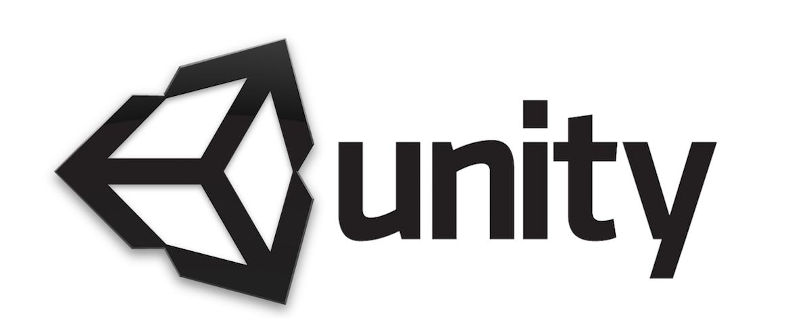

<h1><strong>Skilling Module 1 | Scripting in Unity</strong></h1>

Tutor: Octavian Gheorghiu

<h1>Overview and purpose</h1>

The class aims to introduce students to game engine scripting as a tool for design exploration and design communication. At the end of the class the students will build an app that explores an algorithm related to their design concept.

<h1>Education Standards</h1>
<ol>
<li>Inspire, motivate and challenge students</li>
<li>Make productive use of assessments</li>
<li>Adapt classes to respond to strengths and needs of students</li>
</ol>
<h1><strong>Objectives</strong></h1>
<ol>
<li>Learn the necessary skills required to write and execute code</li>
<li>Learn the necessary skills to produce an app or a video game</li>
</ol>
<h1>Materials Needed</h1>
<ol>
<li>Unity Game Engine, Version 2017.2</li>
<li>Visual Studio Community 2017</li>
</ol>
<h1>Verification</h1>
<ol>
<li>All the objectives subcategories will be assessed by a small exercise that will require the students to use the newly learned skill</li>
<li>Skills development will require previous understanding of learned skills to proceed, thus showcasing when a necessary skill has yet to be learned</li>
<li>The final exercise will require the usage of most of the learned skills</li>
</ol>
<h1>Lesson Plan</h1>

Five sessions totalling 10 hours:

<ol>
<li>Session 1: Scripting in Unity and Data Structures
<ol>
<li>Variables</li>
<li>Functions</li>
<li>Arrays</li>
<li>Lists</li>
<li>Dictionaries</li>
</ol>
</li>
<li>Session 2: Conditionals, Loops and Classes
<ol>
<li>Shorthand conditions</li>
<li>For and foreach loops</li>
<li>Class extension</li>
<li>Interfaces</li>
<li>Composition</li>
</ol>
</li>
<li>Session 3: Scrip logic in Unity and Debugging
<ol>
<li>Updates and Delta Time</li>
<li>Translate, rotate and scale</li>
<li>Keyboard input</li>
<li>Mouse input</li>
<li>Linking scripts to Unity editor</li>
<li>Debugging</li>
<li>The Call Stack</li>
<li>Logging exceptions</li>
</ol>
</li>
<li>Session 4: Prefabs and Advanced Scripting
<ol>
<li>Creating prefabs</li>
<li>Storing and managing prefabs</li>
<li>Coroutines</li>
<li>Events and messaging system</li>
<li>Ray casting</li>
<li>Dynamic meshes</li>
<li>Quadtrees</li>
</ol>
</li>
<li>Session 5: Conway`s game of Life Example
<ol>
<li>Algorithm explanation</li>
<li>Unity implementation</li>
<li>Output from code</li>
</ol>
</li>
</ol>
<h1>Homework assignments</h1>
<ol>
<li>Session 1 homework:
<ol>
<li>Declare a int variable and set a value</li>
<li>Declare a float variable and set a value</li>
<li>Declare a string variable and set a value</li>
<li>Create a function that prints the declared variables</li>
<li>Declare and initialize an array</li>
<li>Declare and initialize a list</li>
<li>Create and initialize a Dictionary</li>
</ol>
</li>
<li>Session 2 homework:
<ol>
<li>Write a function that uses a condition</li>
<li>Write a for loop</li>
<li>Write a dog class and initialize an instance of the class</li>
</ol>
</li>
<li>Session 3 homework:
<ol>
<li>Create a cube and move it across the screen</li>
<li>Create a cube and change its colour when key is pressed or mouse is pressed</li>
<li>Add a script to a game object</li>
</ol>
</li>
<li>Session 4 homework:
<ol>
<li>Create a cube prefab that has a script attached to it</li>
<li>Write a change colour coroutine</li>
<li>Create a cube array and change destroy them in play mode using ray casting</li>
</ol>
</li>
</ol>
<h1>Final assignment</h1>

Modify the Unity implementation of Conway`s game of life by:

<ol>
<li>Add a coroutine to change the cubes colour based on time spent alive</li>
<li>Store in a data structure the results of various frames</li>
<li>Altering the rules of the game to produce new results</li>
</ol>
<h1>Online support tutorials</h1>
<ul>
<li>Object Oriented Languages: https://goo.gl/chcD4L</li>
<li>C# for Unity: https://goo.gl/dJsHf6</li>
<li>Understanding Unity Scripting: https://goo.gl/hY1Fft</li>
<li>Advanced Unity Scripting: https://goo.gl/uXct66</li>
</ul>
<h1>Grading</h1>
<ul>
<li>Class Participation &ndash; 30%</li>
<li>Class Homework &ndash; 70%</li>
</ul>
<h1>Plagiarism</h1>

UCL takes plagiarism very seriously and regards it as a form of fraud. The definition of plagiarism that has been adopted by the School of Continuing and Professional Studies is as follows: "Plagiarism is presenting someone else's work as though it were one's own. More specifically, plagiarism is to present as one's own words quoted without quotation marks from another writer; a paraphrased passage from another writer&rsquo;s work; or facts or ideas gathered, organized, and reported by someone else, orally and/or in writing. Since plagiarism is a matter of fact, not of the student's intention, it is crucial that acknowledgement of the sources be accurate and complete. Even where there is not a conscious intention to deceive, the failure to make appropriate acknowledgement constitutes plagiarism. Penalties for plagiarism range from failure for a paper or course to dismissal from the University.

<h1>Instructor</h1>

Reuse and building upon ideas or code are major parts of modern software development. As a professional programmer you will never write anything from scratch. This class is structured such that all solutions are public. You are encouraged to learn from the work of your peers. I won't hunt down people who are simply copying-and-pasting solutions, because without challenging themselves, they are simply wasting their time and money taking this class.

Please respect the terms of use and/or license of any code you find, and if you reimplement or duplicate an algorithm or code from elsewhere, credit the original source with an inline comment.

